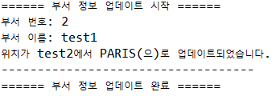
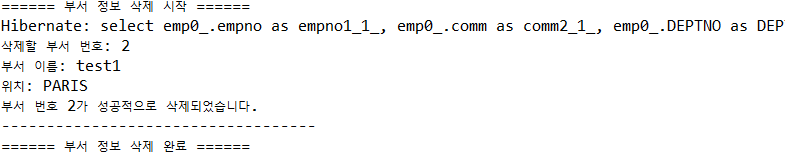

# JPAJoin_edu🎆

## JPA를 이용하여 Emp와 Dept 테이블을 deptno 값으로 join 연산을 하고 CRUD 작업 진행


### Dept.java ✨
```
package step04.miniproject;


import javax.persistence.Column;
import javax.persistence.Entity;
import javax.persistence.Id;

import lombok.AllArgsConstructor;
import lombok.Getter;
import lombok.NoArgsConstructor;
import lombok.NonNull;
import lombok.RequiredArgsConstructor;
import lombok.Setter;
import lombok.ToString;

@NoArgsConstructor
@AllArgsConstructor
@RequiredArgsConstructor

@Getter
@Setter
@ToString

@Entity
public class Dept {

	@Id
	@Column(name = "DEPTNO")
	private Long DEPTNO;
	
	@NonNull
	@Column(name="DNAME", length = 20)
	private String DNAME;
	
	@NonNull
	@Column(name="LOC", length = 20)
	private String LOC;

}
```

### Emp.java ✨

```
package step04.miniproject;


import java.sql.Date;

import javax.persistence.Column;
import javax.persistence.Entity;
import javax.persistence.Id;
import javax.persistence.JoinColumn;
import javax.persistence.OneToOne;

import lombok.AllArgsConstructor;
import lombok.Getter;
import lombok.NoArgsConstructor;
import lombok.NonNull;
import lombok.RequiredArgsConstructor;
import lombok.Setter;
import lombok.ToString;

@NoArgsConstructor
@AllArgsConstructor
@RequiredArgsConstructor 
@Getter
@Setter
@ToString
@Entity
public class Emp {
	
	@Id
	@Column(name="empno")
	private Long empNo;
	
	@NonNull
	@Column(name="ename", length=20)
	private String eName;
	
	@NonNull
	@Column(name="job", length=20)
	private String job;
	
	@NonNull
	@Column(name="mgr", length = 20)
	private Long manager;
	
	@NonNull
	@Column(name="hiredate")
	private Date hireDate;
	
	@NonNull
	@Column(name="sal")
	private Long salary;
	
	@NonNull
	@Column(name="comm")
	private Long comm;
	
	@NonNull
	@OneToOne //(fetch = FetchType.LAZY)
	@JoinColumn(name="DEPTNO")
	private Dept deptNo;
}
```

### RunTest.java

#### Create ✨
```
public void step01Test() {
		EntityManager em = null;
		EntityTransaction tx = null;

		try {
			em = DBUtil.getEntityManager();
			tx = em.getTransaction();
			tx.begin();

			Dept d1 = new Dept(2L, "test1", "test2");
			em.persist(d1);
			Emp newEmployee = new Emp(1L, "이름", "직업", 22L, new Date(System.currentTimeMillis()), 3000L, 200L, d1);
			em.persist(newEmployee);

			tx.commit();
			printEmp(em);
			updateDeptLoc(em);
			deleteDeptAndEmp(em);

		} catch (Exception e) {
			if (tx != null && tx.isActive()) {
				tx.rollback();
			}
			e.printStackTrace();
		} finally {
			if (em != null) {
				em.close();
			}
		}
	}
```

#### Read ✨
```
private void printEmp(EntityManager em) {
		List<Emp> employees = em.createQuery("SELECT e FROM Emp e JOIN e.deptNo", Emp.class).getResultList();
		int index = 1;

		for (Emp emp : employees) {
			System.out.println("============== 직원 정보 [" + index + "] ==============");
			System.out.println("사원 번호: " + emp.getEmpNo());
			System.out.println("이름: " + emp.getEName());
			System.out.println("직업: " + emp.getJob());
			System.out.println("관리자: " + emp.getManager());
			System.out.println("입사일: " + emp.getHireDate());
			System.out.println("급여: " + emp.getSalary());
			System.out.println("커미션: " + emp.getComm());
			System.out.println("-------------- 부서 정보 --------------");
			if (emp.getDeptNo() != null) {
				System.out.println("부서 번호: " + emp.getDeptNo().getDEPTNO());
				System.out.println("부서 이름: " + emp.getDeptNo().getDNAME());
				System.out.println("부서 위치: " + emp.getDeptNo().getLOC());
			} else {
				System.out.println("연관된 부서 정보가 없습니다.");
			}
			System.out.println("======================================\n");
			index++;
		}
	}
```

#### 실행 결과


</br>

#### Update ✨
```
private void updateDeptLoc(EntityManager em) {
		EntityTransaction tx = em.getTransaction();
		tx.begin();
		List<Dept> depts = em.createQuery("SELECT d FROM Dept d WHERE d.DEPTNO = 2", Dept.class).getResultList();

		System.out.println("====== 부서 정보 업데이트 시작 ======");
		for (Dept dept : depts) {
			if (dept != null) {
				String oldLoc = dept.getLOC();
				dept.setLOC("PARIS");
				System.out.println("부서 번호: " + dept.getDEPTNO());
				System.out.println("부서 이름: " + dept.getDNAME());
				System.out.println("위치가 " + oldLoc + "에서 " + dept.getLOC() + "(으)로 업데이트되었습니다.");
				System.out.println("-----------------------------------");
			}
		}
		System.out.println("====== 부서 정보 업데이트 완료 ======\n");
		tx.commit();
	}
```
#### 실행 결과


</br>

#### Delete ✨
```
private void deleteDeptAndEmp(EntityManager em) {
		EntityTransaction tx = em.getTransaction();
		tx.begin();
		List<Dept> depts = em.createQuery("SELECT d FROM Dept d WHERE d.DEPTNO = 2", Dept.class).getResultList();

		System.out.println("====== 부서 정보 삭제 시작 ======");
		for (Dept dept : depts) {
			if (dept != null) {
				// 부서에 속한 직원들의 관계를 먼저 제거
				List<Emp> employeesInDept = em.createQuery("SELECT e FROM Emp e WHERE e.deptNo = :dept", Emp.class)
						.setParameter("dept", dept)
						.getResultList();

				for (Emp emp : employeesInDept) {
					em.remove(emp);
				}

				System.out.println("삭제할 부서 번호: " + dept.getDEPTNO());
				System.out.println("부서 이름: " + dept.getDNAME());
				System.out.println("위치: " + dept.getLOC());

				em.remove(dept);
				System.out.println("부서 번호 " + dept.getDEPTNO() + "가 성공적으로 삭제되었습니다.");
				System.out.println("-----------------------------------");
			}
		}
		System.out.println("====== 부서 정보 삭제 완료 ======\n");
```
#### 실행 결과


-------------------------

## 고찰
#### sql문에서 join은 
#### SELECT * FROM EMP e, DEPT d WHERE e.DEPTNO = d.DEPTNO;
#### 같은 식으로 진행되지만
</br>

#### JPAJoin은
#### "select e from Emp e join e.deptno d where e.deptno = e.deptno.deptno", Emp.class 
#### 처럼 Dept 테이블을 Emp 테이블에서 ENTITY 객체로 가져오기 때문에 이것을 주의해 사용해야 한다